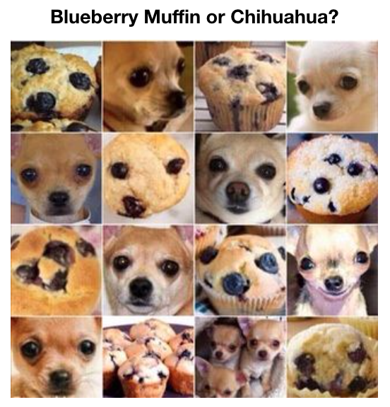

# Classifying images as Chihuahuas or Blueberry Muffins
## General Assembly: Data Science Immersive Capstone Project

### Problem Statement: 

**Background - Meme**: In 2016, a meme went viral that asked people a question they'd likely never thought would be challenging before: Can you tell the difference between these images that you never before thought looked alike? 

(source: Elle Magazine, https://www.elle.com/culture/news/a34939/animals-or-food/)

As the owner of a Chihuahua, my interest zeroed in on this pairing: 

**Background - Image Classification**: A statement often made about image classification algorithms is that though they can quickly distinguish between thousands of images with *pretty good* accuracy, a child can distinguish between images with *much better accuracy*. 

The question of Chihuahua versus Blueberry Muffin fascinated me because--in the case of the particular close up angles selected for the meme--this is not a case when a human can easily distinguish between these images. 

**Problem Statement**: After building an image classification model that can predict whether an image is of a Chihuahua or a Blueberry Muffin trained on zoomed out distinctly different photos, can that image classification model accurately predict the classification for the challenging zoomed in photos from the meme?

### Model Types: 
I began with a CNN trained from scratch on the scraped images. The maximum accuracy I gathered from this was 85%. I then incorporated Image Data Generation to increase my training size. This did not improve my accuracy but did increase the speed of running the model. Finally, I implemented transfer Learning and achieved >99% accuracy. 

